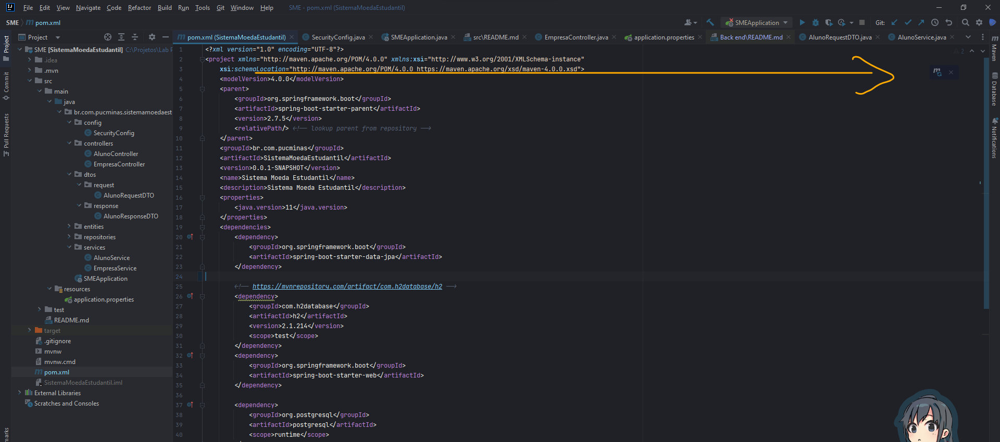
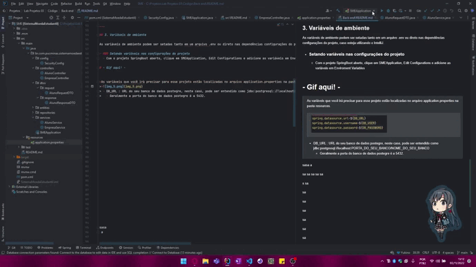
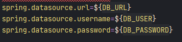

# Instruções gerais para rodar o projeto localmente
___

## Sumário
1. Instalação da IDE
2. Abrindo o projeto
3. Configurando as varíaves de ambiente
4. Rodando o projeto
5. Endpoints da aplicação

___

> Antes de tudo, verifique se ao menos a versão 11 da JDK está instalada.

## 1. Instalação da IDE

### IntelliJ
 Para fazer o download da IDE da Jet Brains, entre no [site oficial](https://www.jetbrains.com/pt-br/idea/download/) e 
 Realize o download conforme seu sistema operacional.
 
- ### IntelliJ IDEA Community 
  - Versão gratuita do intelliJ, proporciona o básico da experiência, com suporte as linguágens Java, Kotlin, Groovy e Scala, possui integração com mo docker, depurador próprio e integração autimatizada também com repositórios GIT.

- ### IntelliJ  IDEA Ultimate:
  - Recomendado para tudo, com clientes dedicados, suporte a inúmeros frameworks, bancos de dados, desenvolvimento colaborativo além de tudo que o Community já proporciona.

> - Recomendo fortemente, claro, a versão ultimate uma vez que possui maiores benefícios e flexibilidade ao desenvolver projetos maiores.
> Além de tudo, a licença ultimate está disponível para estudantes portanto, vamos seguir com o download partindo desta versão.

jdbc:postgresql://localhost:5432/Lab03

Mais informações sobre as licenças gratuítas e para quem elas se aplicam podem ser visualizadas [aqui](https://www.jetbrains.com/community/education/#students/faq).

Após a instalação e aplicação da possível licença recebida na ID, é hora de abrir o projeto.

## 2. Abrindo o projeto

com a IDE já aberta e o repositório do projeto já no computador o processo se torna simples, caso a tela de seleção de projeto não abra automaticamente,
basta ir até File, Open e selecionar a pasta do projeto.
 

___

Com o projeto aberto, basta, agora baixar as dependências do maven, que se encontram no arquivo pom.xml, logo na raiz do projeto.
Ao abrir o arquivo, as dependências irão ser baixadas automaticamente, e podem ser acompanhadas na parte inferior da aplicação.

> Caso o download de dependências não inicie automaticamente, ao abrir o arquivo pom.xml, um ícone do maven deve aparecer no canto superior esquerdo (conforme a imagem)
>. Ao clicar, o carregamento das dependências irá iniciar.

___

## 3. Variáveis de ambiente

As variáveis de ambiente podem ser setadas tanto em um arquivo .env ou direto nas dependências configurações do projeto, caso esteja utilizando o IntelliJ.

- ### Setando variáveis nas configurações do projeto 
  - Com o projeto SpringBoot aberto, clique em SMEApplication, Edit Configurations e adicione as variáveis em Enviroment Variables

>As variáveis que você irá precisar para esse projeto estão localizadas no arquivo application.properties na pasta resources.
>>
> - DB_URL: URL do seu banco de dados postegre, neste caso, pode ser entendido como jdbc:postgresql://localhost:PORTA_DO_SEU_BANCO/NOME_DO_SEU_BANCO
>   - Geralmente a porta do banco de dados postegre é a 5432.
> - DB_USER: Usuário do postgre, geralmente o padrão é "postgres"
> - DB_PASSWORD: Senha do banco de dados.

___
## 4. Rodando o projeto

Para rodar o projeto, basta clicar em RUN ao lado de SMEApplication ou clicar com o botão direito na classe principal "SMEApplication" e clicar em Run.

A porta do app está configurada como 3001, portanto irá ser hospedado em "http://localhost:3001/".

___
## 5. Endpoints da aplicação

- ainda em construção.
